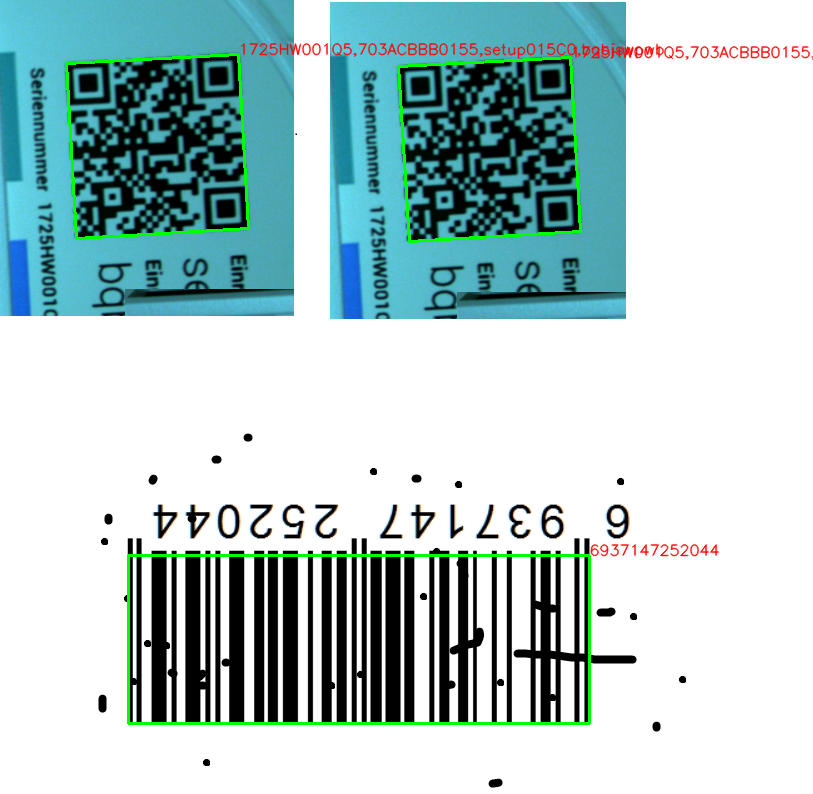
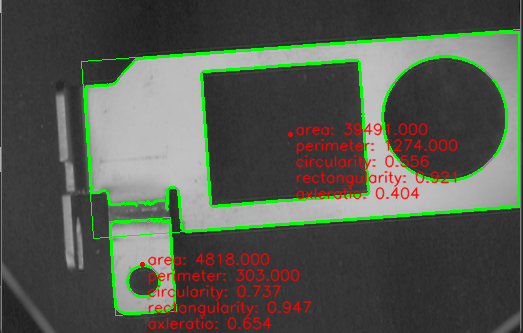
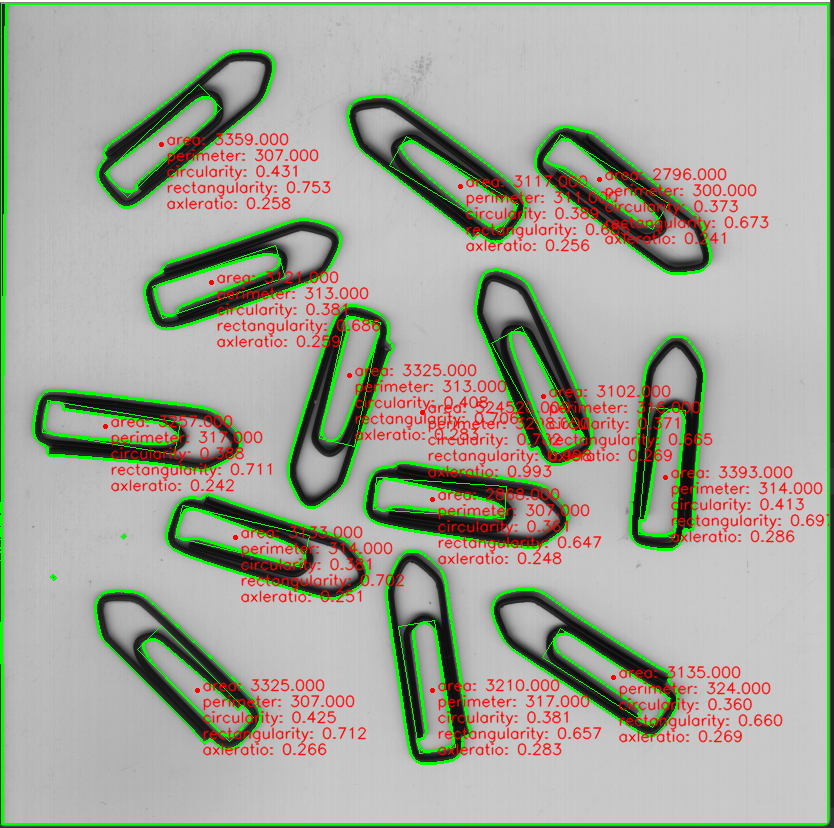

# DVisionLibs
Traditional machine vision algorithm library, including code reading, blob detection, circle detection, line detection, shape matching, contour matching, chessboard calibration, etc

1.Read Barcode 
基于ZXing库,主要提供了非本地图像路径而是从变量进行识别的接口，支持C++和pyd接口 
用法： 
a.C++ 
  首先按照说明配置路径,将项目属性的配置类型改成"应用程序.exe" 
  执行test.cpp 
b.python 
  执行pymodels下的test.py 
c.修改编译pyd 
  修改后注意将项目属性的配置类型改成"动态库.dll",将配置属性-高级-高级属性-目标文件扩展名改成:.pyd 
d.修改编译dll 
  修改后注意将项目属性的配置类型改成"动态库.dll",将配置属性-高级-高级属性-目标文件扩展名改成:.dll 
e.需要选择编译指定模块,在设置中设置生成库文件的名称,其他的模块需要在vs中设置选择从项目中排除
  
 

2.Blob Detection 
用法同上 
a.python版本中可以查看检测结果 
 
 
