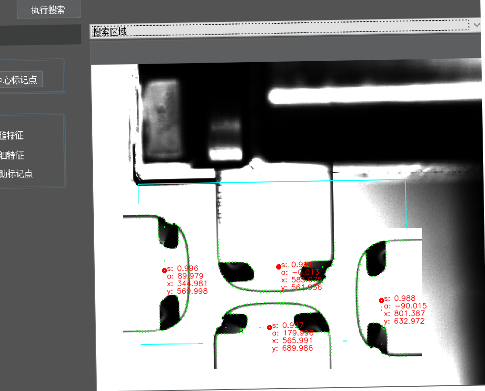
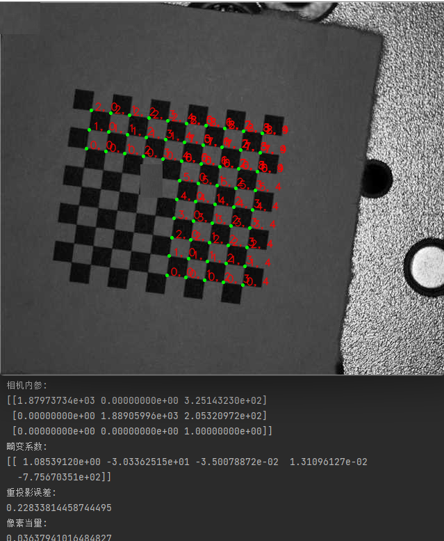
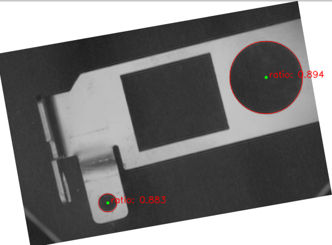
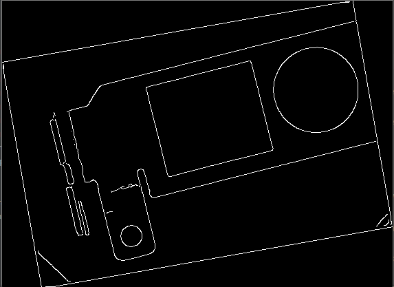

# DVisionLibs
Traditional machine vision algorithm library(functions/tools), including barcode reading, blob detection, circle detection, line detection, shape matching, contour matching, chessboard calibration, etc

计划开源一些项目中常用的算法/功能工具，希望能够即开即用。如果对你有帮助的话烦请star一下，感谢。

## 所有的项目提供了C++源码及编译pyd后python的使用方法和参数说明 

### 1.Read Barcode 
基于ZXing库,主要提供了非本地图像路径而是从变量进行识别的接口，支持C++和pyd接口 
用法： 
a.cpp 
  首先按照说明配置路径,将项目属性的配置类型改成"应用程序.exe" 
  执行test.cpp 
b.python 
  执行pymodels下的test.py 
c.修改编译pyd 
  修改后注意将项目属性的配置类型改成"动态库.dll",将配置属性-高级-高级属性-目标文件扩展名改成:.pyd 
d.修改编译dll 
  修改后注意将项目属性的配置类型改成"动态库.dll",将配置属性-高级-高级属性-目标文件扩展名改成:.dll 
e.需要选择编译指定模块,在设置中设置生成库文件的名称,其他的模块需要在vs中设置选择从项目中排除
	
	部分参数的快速了解
	bool is_pure = false; // 如果输入仅包含完美对齐的条形码（生成的图像），则设置为 True,在这种情况下加快检测速度。
	bool try_rotate = true; // True:解码器在任何方向搜索条形码; False:不会搜索 90° / 270° 旋转的条形码。
	bool try_downscale = true; // True:解码器会扫描输入的缩小版本；False:只会在提供的分辨率中搜索
	ZXing::BarcodeFormats formats = ZXing::BarcodeFormats{}; // 要解码的格式。 如果“无”，则解码所有格式。
	ZXing::TextMode text_mode = ZXing::TextMode::HRI; // 指定控制原始字节内容如何转码为结果中的文本的 TextMode
	ZXing::Binarizer binarizer = ZXing::Binarizer::LocalAverage; // 二值化器用于在解码条形码之前转换图像
	ZXing::EanAddOnSymbol ean_add_on_symbol = ZXing::EanAddOnSymbol::Ignore; // 指定在扫描 EAN/UPC 代码时是忽略、读取还是需要 EAN-2/5 附加符号。
	更多的format和TextMode等请参考Zxing的说明

	Mat src1 = imread("img/DVisionBarcode/bar2.bmp");
	imshow("Display window1", src1);
	BarcodeRecognize t1 = BarcodeRecognize();
	if (1)
	{
		t1.recognizes(src1);
		auto results = t1.getResults();//多码
		cout << results.size() << endl;
		DrawResult(src1, results[1]);

	}
	else
	{	
		t1.recognize(src1);
		auto result = t1.getResult();;//单码
		cout << result.value().text() << endl;
		DrawResult(src1, result.value());
	}

	imshow("Display window", src1);
	
	waitKey();
	return 0;

  
 

### 2.Blob Detection 
用法同上 
a.python版本中可以查看检测结果 

	部分参数的快速了解
	可设置参数:
	// 二值化参数
	int autoThreshold = 1;
	int minThreshold = 150;
	int maxThreshold = 255;

	// 连通域颜色 黑0/白1
	bool blobColor = 1;

	// 面积筛选
	bool filterByArea = true;
	int minArea = 25;
	int maxArea = INT_MAX;

	// 长短轴比筛选
	bool filterByInertia = true;
	float minInertiaRatio = 0.1f;
	float maxInertiaRatio = 1;

	// 凸性筛选 凸形状指的是该形状的任意两点之间的线段都完全位于该形状内部
	/*bool filterByConvexity = true;
	float minConvexity = 0.95f;
	float maxConvexity = std::numeric_limits<float>::max();*/

	// 矩形度筛选（面积与最小外接矩形之比）
	bool filterByRectangularity = false;
	float minRectangularity = 0.1f;
	float maxRectangularity = 1;

	// 周长筛选
	bool filterByPerimeter = false;
	int minPerimeter = 25;
	int maxPerimeter = INT_MAX;

	// 圆形度筛选
	bool filterByCircularity = false;
	float minCircularity = 0.1;
	float maxCircularity = 1;

	// 质心偏移距筛选
	bool filterByCentroidOffset = false;
	int minCentroidOffset = 25;
	int maxCentroidOffset = INT_MAX;

	// 查找个数，排序特征，排序方式
	int maxTargets = 0;
	int sortMethod = 1;  // 0：不排序，1：降序，2：升序
	int sortFeature = 0; // 0：面积，1：周长，2：圆形度，3：矩形度，4：轴比，5：外接矩形中心x，6：中心y

	结果参数:
	int label;										// 连通域标签
	cv::Point2f centroid;							// 质心
	int area;										// 面积
	int perimeter;					    			// 周长
	float circularity;								// 圆形度
	float rectangularity;							// 矩形度
	float axleratio;								// 长短轴之比
	int centroidOffset;			    				// 质心偏移距离
	cv::RotatedRect minRect;						// 最小外接矩形
	std::vector<cv::Point> externalContour;			// 外轮廓
	std::vector<std::vector<cv::Point>> Contour;    // 轮廓

 
 

### 3.ShapeMatch/轮廓匹配 
基于轮廓特征点的匹配 

	输入参数:
	float score = 0.9;			// 匹配分数
	int maxTargets = 0;			// 最大匹配数量
	float overlape = 0;			// 最大重叠率
	float greediness = 0.9;		// 贪婪度
	float angleStart = 0;		// 角度起始值
	float angleRange = 360;		// 角度范围
	float angleStep = 0;		// 角度步长
	float scaleStart = 1;		// 缩放起始值
	float scaleRange = 1;		// 缩放终止值
	float scaleStep = 0.1;		// 缩放步长
	bool with_polarity = true;	// 极性
	int with_subpixel = 0;		// 0：无亚像素 1：多项式拟合亚像素 2：最小二乘法调节位姿亚像素
	int filtSize = 5;			// 滤波尺寸
	结果:
	cv::Point2i pt;
	cv::Point2d ptd;
	double matchScore = 0;
	double matchAngle = 0;
	double matchScale = 0;
	cv::Rect boundingBox;

 
 
 

### 4.NCCMatch/GrayMatch灰度匹配 
除了常用的分数,极性,角度范围,数量,重叠率,亚像素等还包括了支持mask功能,均值和标准差加速功能 

	cv::Mat temp;				// 模板图像

	bool useMask = 0;			// 使用掩码
	cv::Mat mask = cv::Mat();	// 掩码

	float score = 0.8;			// 匹配分数

	int maxtargs = 0;			// 最大匹配数量
	int pyramidLayer = 256;		// 金字塔参数

	float angleStart = 0;		// 匹配角度起始值
	float angleRange = 360;		// 匹配角度范围
	float maxOverlap = 0;		// 最大重叠率

	bool useMean = 0;			// 均值加速
	float mean = 30;
	bool useSDV = 0;			// 标准差加速
	float SDV = 30;

	bool polarity = true;		// 极性
	bool subpixel = 0;			// 亚像素

	结果参数:
	cv::Point2d pt;					/*Match result point*/
	double dMatchScore;			/*Match result Score*/
	double dMatchAngle;			/*Match result Angle*/
	double dAngleStart;			/*Match result Angle range*/
	double dAngleEnd;
	cv::RotatedRect rectR;			/*OpenCV RotatedRect*/
	bool bDelete;				/*do match?*/

	double vecResult[3][3];		/*for subpixel*/
	int iMaxScoreIndex;
	bool bPosOnBorder;
	cv::Point2d ptSubPixel;
	double dNewAngle;

 

### 5.CameraCalibration/ChessboardCalibration棋盘格标定 
参考了基于生长的方法,主要解决的实际项目使用原始的opencv棋盘格标定会出现因为部分角点识别不到导致标定失败

	参数：
	cv::Mat m_gray;										// 灰度图像
	cv::Mat m_imageNorm;								// 归一化图像
	dtype m_scoreThreshold = 0.01;						// 角点筛选分数阈值
	int m_filtSize = 5;

	// 角点检测 中间/结果值
	std::vector<int> m_radius;							 // 多尺度卷积核
	std::vector<cv::Point2f> m_templateProps;			 // 不同原型的核
	std::vector<std::vector<dtype>> m_cornersEdge1;
	std::vector<std::vector<dtype> > m_cornersEdge2;
	std::vector<cv::Point2f> m_cornerPoints;			 //角点
	std::vector<cv::Point2f* > m_cornerPointsRefined;	 //亚像素角点
	Corners m_corners_struct;							 // 角点候选点类

	// 棋盘格结构恢复 中间/结果值
	cv::Mat chessboard;									 // 棋盘格
	std::vector<cv::Mat> m_chessboards;					 // 棋盘格
	float m_lamda = 1;									 // 能量计算加权值

	// 参数计算
	double m_checkerboardSize = 1;

	结果:
	cv::Mat m_chessboardPoints;     // 棋盘点
	cv::Mat m_cameraMatrix;  // 相机内参
	cv::Mat m_distCoeffs;   // 镜头畸变系数
	cv::Mat m_rvecs; // 相机外参-旋转矩阵
	cv::Mat m_tvecs;  // 相机外参-平移矩阵
	cv::Mat m_newObjPoints; // 优化后的新坐标点
	double m_perViewErrors = 0; // 重投影误差
	double m_pixelEquivalent = 0;   // 像素当量
	double m_pixelEquivalent1 = 0;  // 水平像素当量
	double m_pixelEquivalent2 = 0;  // 竖直像素当量

 

### 6.CircleDetection/形状检测-圆 
	
	参数:
	float inlier = 0.5;					// 弧段的内点率
	float closedInlier = 0.5;			// 闭合圆的内点率
	float lineLen = 160;					// 直线弧线交界处断开
	float centerDis = 5;				// 圆心距离
	float radiusDis = 5;				// 半径差距
	float sharpAngle = 60;				// 角度急转处断开
	float SegmentCurvature = 0.01;	// 弧线段曲率，根据弯曲程度断开
	float minLen = 32;					// 最小边缘段
	int filtSize = 5;					// 滤波尺寸

	后续会提供另一个基于梯度计算的纯python的圆形拟合功能
 

### 7.EdgeDetection/边缘检测 
 

后续更新计划:直线检测，基于梯度点的直线拟合检测工具，基于梯度点的圆形拟合检测工具，椭圆检测

# 其他参考
https://github.com/DennisLiu1993/Fastest_Image_Pattern_Matching 
https://github.com/meiqua/shape_based_matching 
https://github.com/sdg002/RANSAC 
https://github.com/glassechidna/zxing-cpp 
