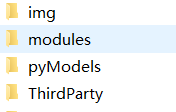
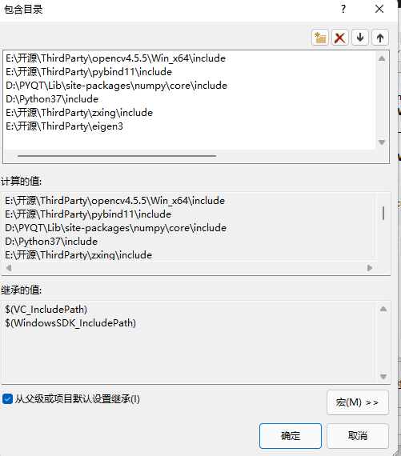
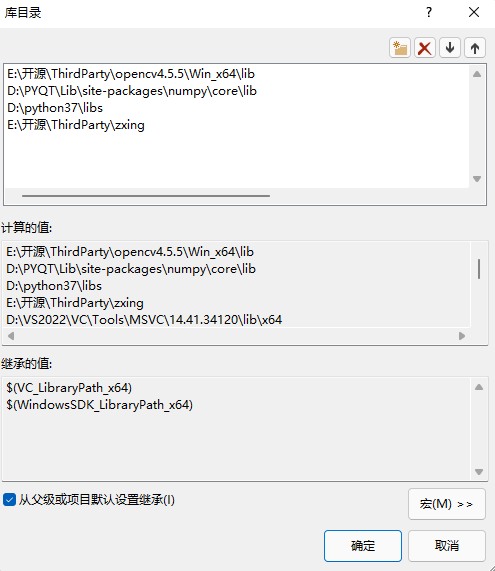
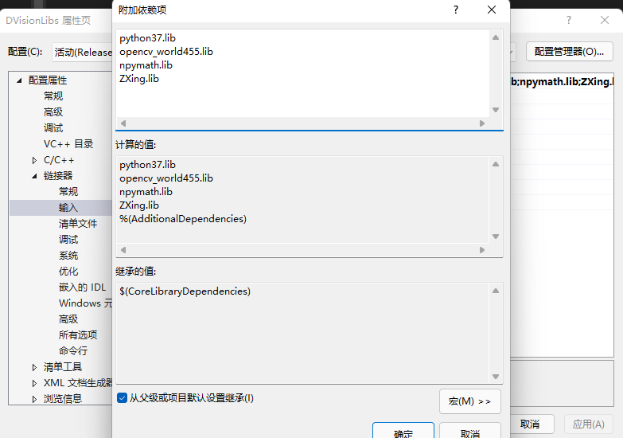

# 1 c++图像算法库

## 1.1 文件目录

**主要包含四个文件：**

**（1）img：用于算法test的图像**

**（2）modules：算法源代码**

**（3）pyModels：算法的python包及test代码**

**（4）ThirdParty：用于c++的第三方库**

## 1.2 c++环境搭建

**（1）VC++目录-包含目录**

**（2）VC++目录-库目录**

**（3）链接器-输入-附加依赖项**

**备注：**

（1）若只需要在c++上运行，则不需要pybind11、python、numpy等相关路径，并不包含对应的pybind.cpp文件。

## 1.3 算法

（1）码识别-DVisionBarcodeRecognize 
	基于Zxing,可解单独码/多个码及多种格式。主要差异是使用接口可以传图像变量而不需要从一个path读取解码 
（2）blob检测-DVisionBlobDetector 
	可设置阈值// 连通域颜色// 面积筛选// 周长筛选// 轴比筛选// 矩形度筛选// 圆形度筛选// 质心距离筛选// 最大数量// 排序 
（3）灰度匹配/NCC匹配-DVisionGrayScaleMatch 
	基于NCC的匹配

